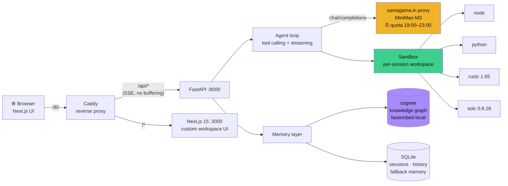
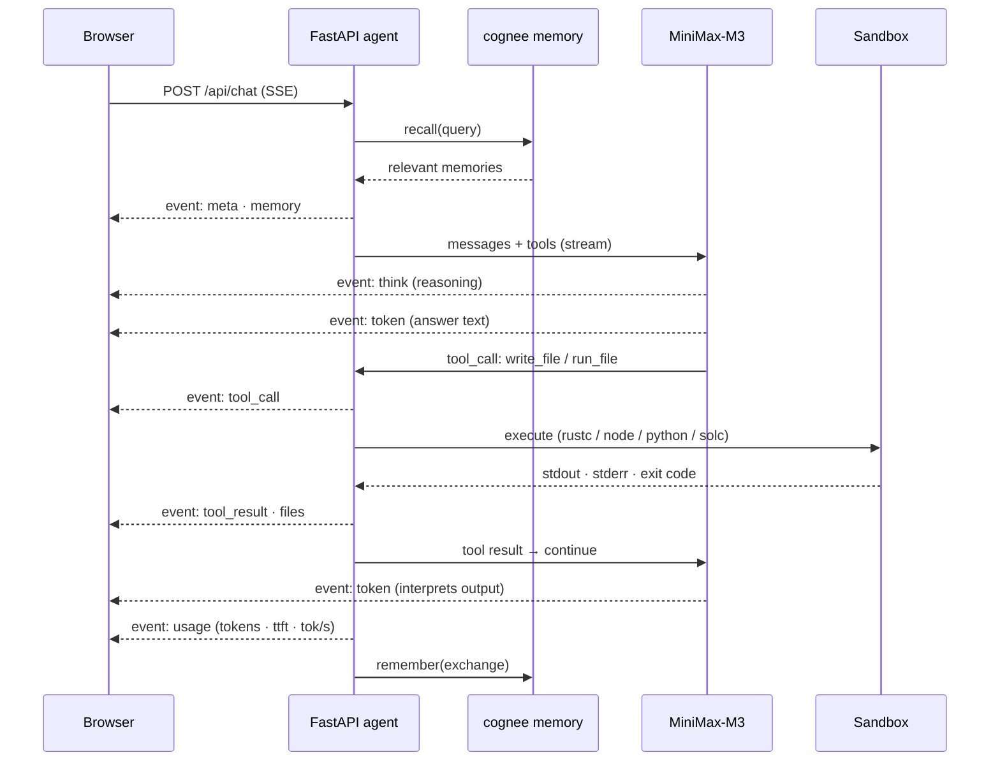
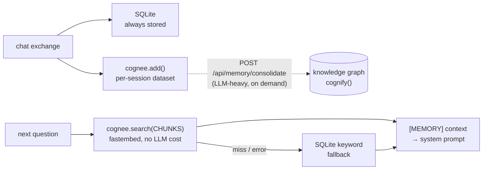

# ◆ Sensei — Web3 Tutor Workspace

An **agentic Web3 tutor**, not a chatbot. Sensei explains blockchain concepts, but also
**creates files, runs code, and compiles Solidity live** in a per-session workspace —
streaming every token with model metadata (time to first token, tokens/sec, tool rounds).

   

## What it does

- **Agentic chat** — the model has tools: `write_file`, `read_file`, `run_file`, `run_snippet`
  (Python / JavaScript / TypeScript / **Rust** via `rustc` / Solidity via real `solc`),
  `list_files`, `delete_file`. Say *"make a mini blockchain in chain.rs and run it"* and
  watch it happen in the workspace panel.
- **Interactive curriculum** — 9 markdown lessons across 4 modules (Foundations → Smart
  Contracts → DeFi → **Beyond Ethereum: Rust, Solana, multi-chain**), rendered live: every
  code block has a **▶ Run** button (executes on the backend), `quiz` blocks become
  clickable checkpoints, and any block can be sent to the tutor with **✦ ask tutor**.
- **Live workspace** — file tree, CodeMirror editor (edit + save + run), and an output console
  that captures both your runs and the agent's runs.
- **Memory layer ([cognee](https://github.com/topoteretes/cognee))** — every exchange is added
  to a per-session knowledge graph (local fastembed embeddings, so retrieval never depends on
  the LLM proxy). Graph consolidation (`cognify`) runs on demand via
  `POST /api/memory/consolidate`. SQLite keyword search is the automatic fallback.
- **Full metadata** — each answer shows model, total time, time-to-first-token,
  prompt/completion tokens, tokens/sec and tool rounds.

## Architecture



### One chat turn, end to end



### Memory pipeline



## Run locally

```bash
# .env at repo root:
#   base_url=https://samagama.in/platform/proxy/v1
#   api_key=sk_live_…
#   model=MiniMax-M3

# backend
cd backend && python3 -m venv .venv && .venv/bin/pip install -r requirements.txt
.venv/bin/uvicorn app.main:app --reload --port 8000

# frontend (second terminal)
cd frontend && npm install && npm run dev
# → http://localhost:3000
```

Or with Docker: `docker compose up --build` → http://localhost.

> **Note** — the samagama model quota is active **19:00–23:00**; outside that window
> chat requests will fail (the UI surfaces this).

## Deploy (DigitalOcean)

```bash
doctl compute droplet create web3-tutor --image docker-20-04 --size s-1vcpu-2gb --region blr1 --ssh-keys <id>
# then on the droplet:
curl -fsSL https://raw.githubusercontent.com/FiscalMindset/web3/main/deploy/setup-droplet.sh | bash
```

`deploy/setup-droplet.sh` adds swap, clones this repo, and starts the compose stack.
Create `/opt/web3-tutor/.env` before the first run.

## API surface

| Route | What |
|---|---|
| `POST /api/chat` | SSE stream: `meta, memory, token, tool_call, tool_result, files, usage, done` |
| `POST /api/run` | Run a snippet (lesson Run buttons) |
| `GET/POST /api/sessions…` | Sessions, history, workspace files (read/save/run) |
| `GET /api/lessons[/slug]` | Curriculum |
| `POST /api/memory/consolidate` | Trigger cognee `cognify` in background |
| `GET /api/health` | Model + memory status |

## Security note

The code runner is a subprocess with CPU/time/file-size limits inside the backend Docker
container — fine for tutoring snippets, not a hostile-multi-tenant boundary. Keep it behind
Docker (the compose stack does).
